<div align="center">


# PunamIDE v2.1.2

**A native AI-powered code editor built with Tauri 2, React 19, and Monaco Editor.**  
Multi-provider AI, agentic tool-calling, technical debt analysis, and a full IDE experience — all running locally on your machine.

<br/>

[](CHANGELOG.md)
[](LICENSE)
[](https://tauri.app)
[](https://react.dev)
[](https://www.rust-lang.org)
[](https://www.typescriptlang.org)
[](https://microsoft.github.io/monaco-editor)
[](https://punamide.com)

<br/>

[](https://github.com/punamide/punamide-downloads/releases/tag/v2.1.2)
[](https://punamide.com)
[](https://discord.gg/PFp9KWY3eY)
[](https://x.com/PunamIDE)

<br/>

[](#ai-providers)
[](#agent-tools)
[](#project-structure)
[](#testing)

<br/>

> PunamIDE is an open-source desktop IDE , it's a full desktop IDE with a native Rust backend, real terminal, Git integration, GitHub management, DAP debugger, local embeddings, architecture analysis, and a multi-agent system that can autonomously read, write, and refactor your codebase.

</div>

---

## Table of Contents

- [Screenshots](#screenshots)
- [Quick Start](#quick-start)
- [Tech Stack](#tech-stack)
- [AI Providers](#ai-providers)
- [Features](#features)
  - [AI Chat & Agentic System](#ai-chat--agentic-system)
  - [Code Editor](#code-editor)
  - [Autocomplete](#autocomplete)
  - [Terminal](#terminal)
  - [Git & GitHub](#git--github)
  - [Debugger](#debugger)
  - [Technical Debt Analyzer](#technical-debt-analyzer)
  - [Architecture Analysis](#architecture-analysis)
  - [Security Scanner](#security-scanner)
  - [Embeddings & RAG](#embeddings--rag)
  - [CI/CD Integration](#cicd-integration)
  - [Docker](#docker)
  - [MCP Support](#mcp-support)
- [Project Structure](#project-structure)
- [Keyboard Shortcuts](#keyboard-shortcuts)
- [Configuration](#configuration)
- [Testing](#testing)
- [Build](#build)
- [Contributing](#contributing)
- [License](#license)

---

## Screenshots

### Main Interface


### BYOK — Bring Your Own Key (Multi-Provider)
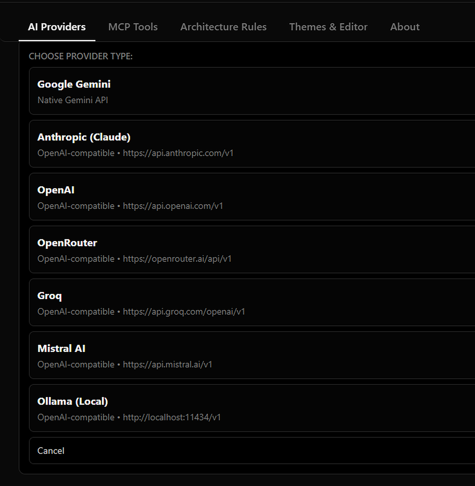

### Technical Debt Analysis
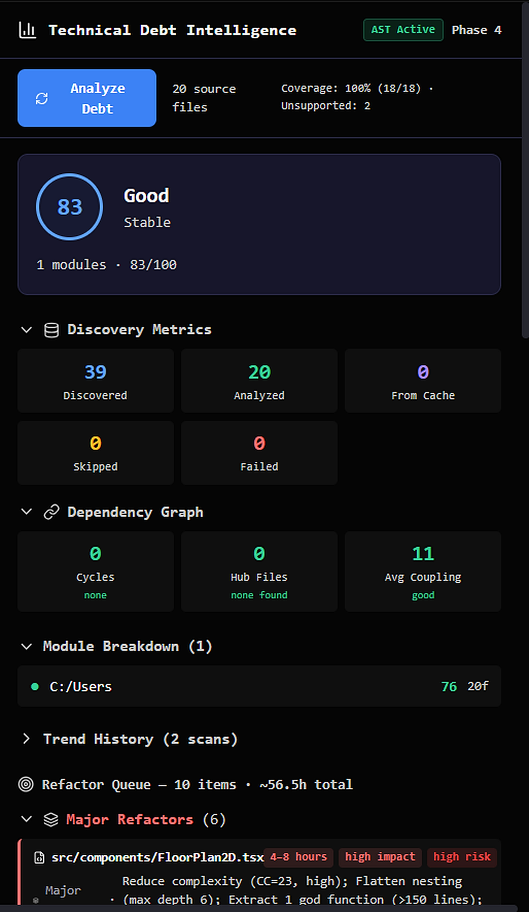

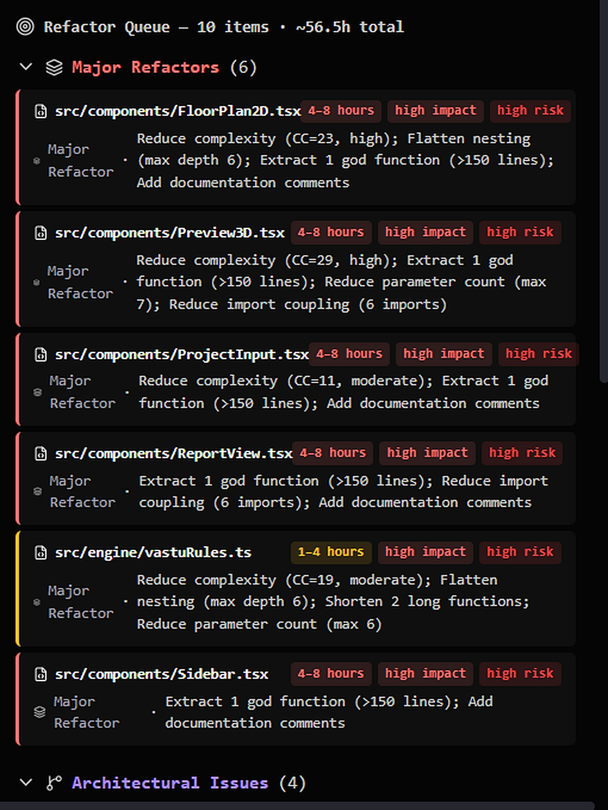

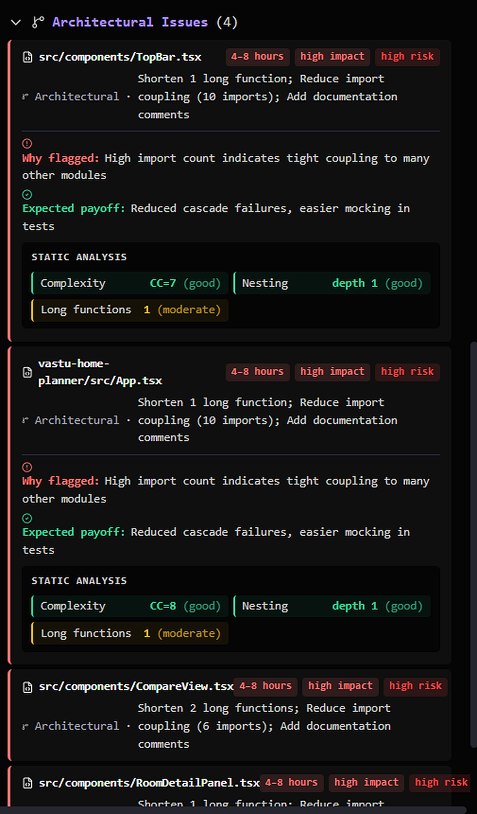

### Architecture & Dependency Graph
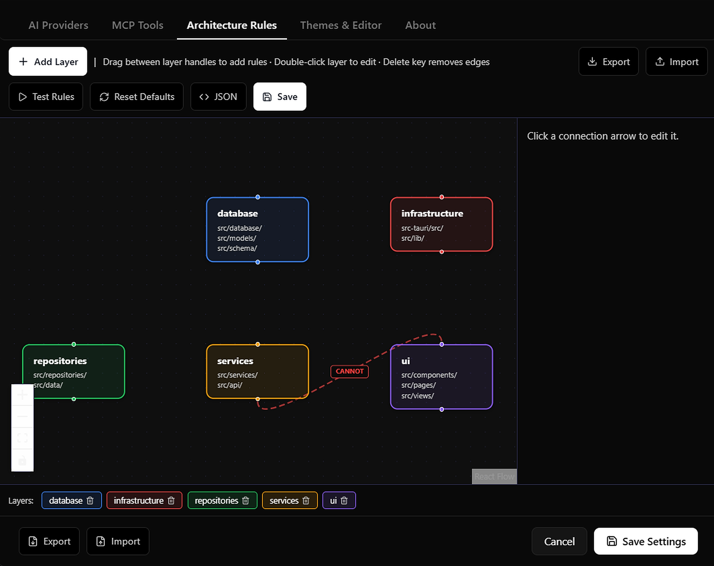

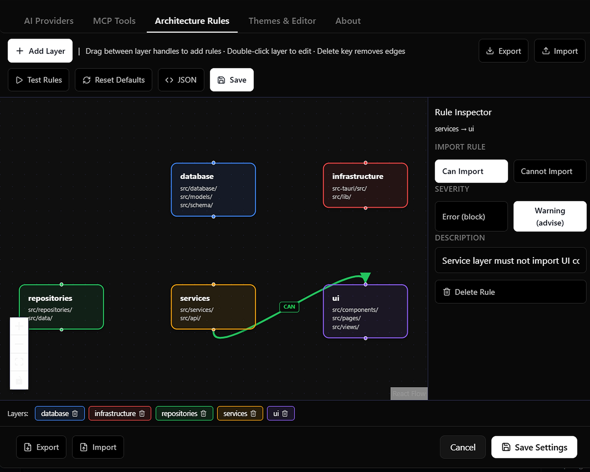

### GitHub Integration
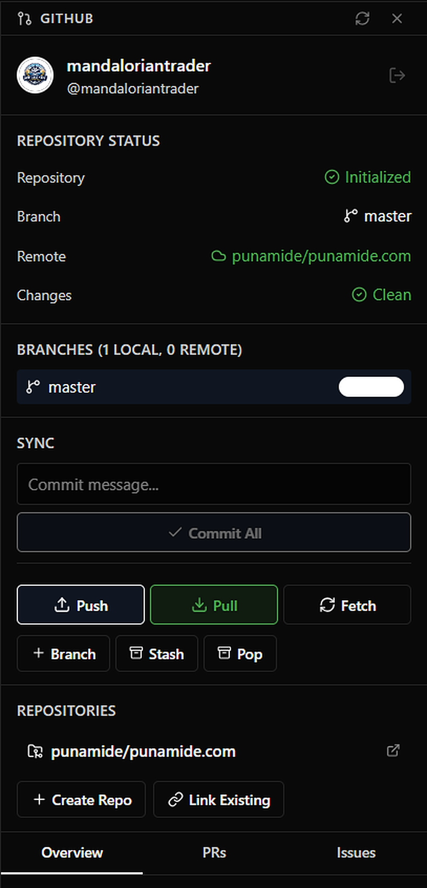

### Git Source Control
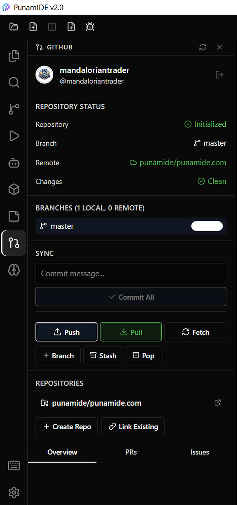

### Snapshot Manager
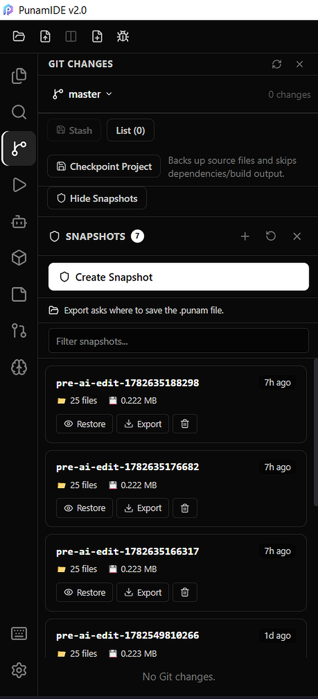

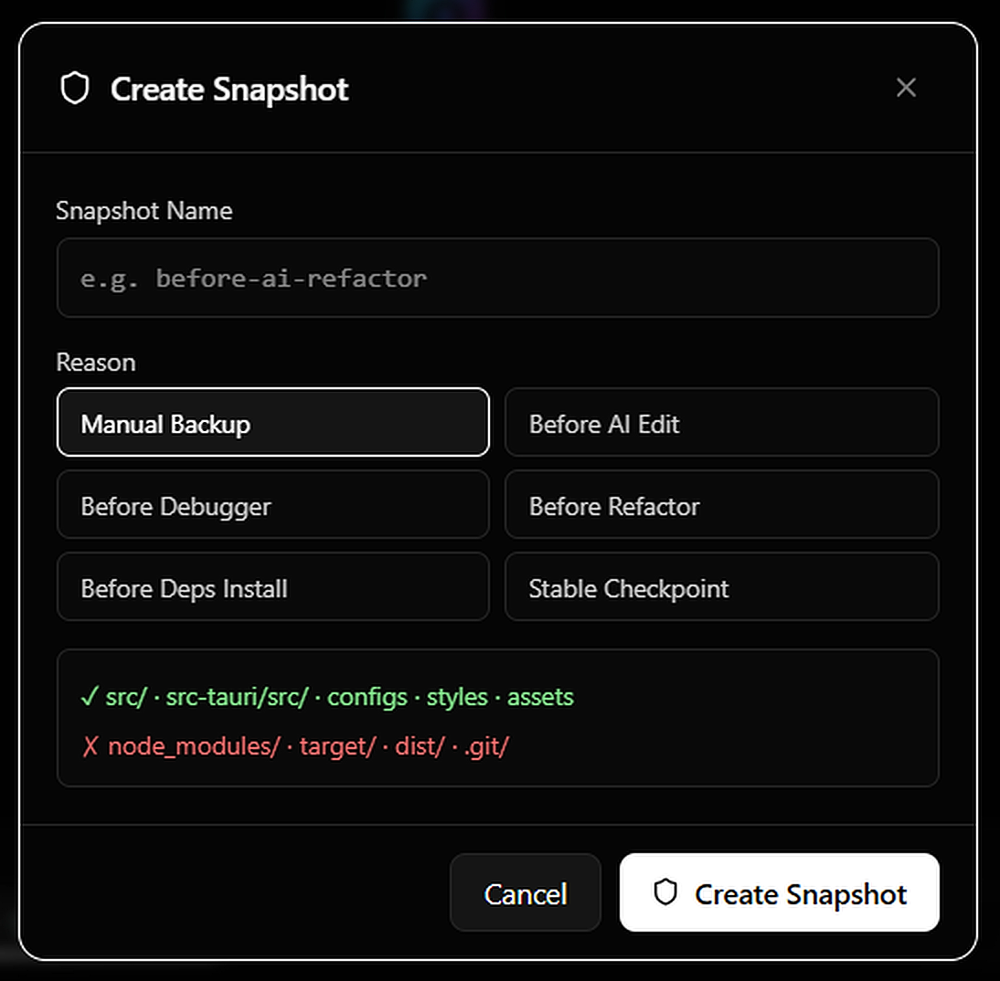

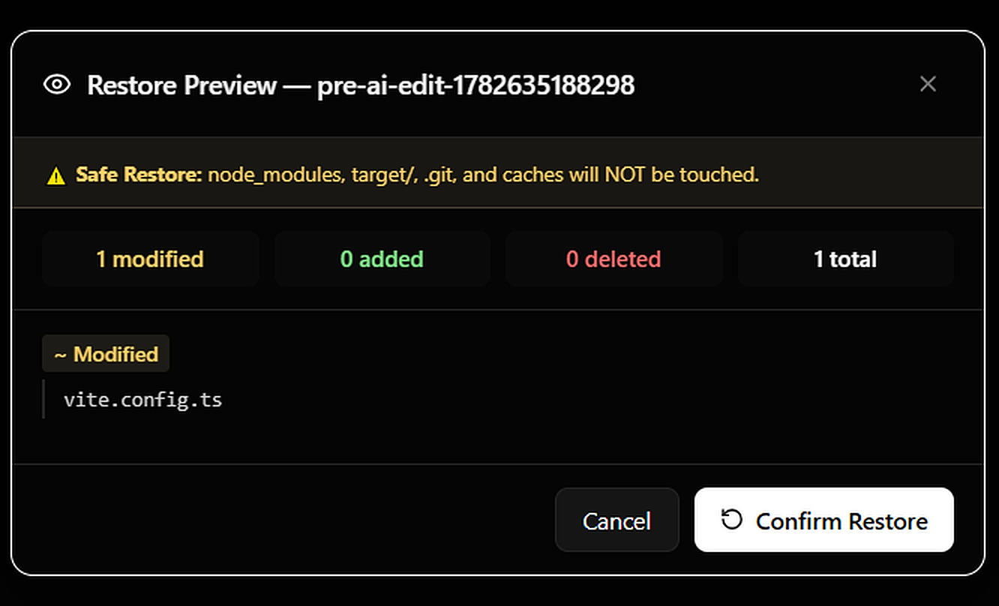

---

## Download

> **Windows only (alpha).** macOS and Linux builds are planned.

| Installer | Link |
|---|---|
| Windows Installer (recommended) | [PunamIDE v2.0_2.1.2_x64-setup.exe](https://github.com/punamide/punamide-downloads/releases/download/v2.1.2/PunamIDE.v2.0_2.1.2_x64-setup.exe) |
| Windows MSI (admin/enterprise) | [PunamIDE v2.0_2.1.2_x64_en-US.msi](https://github.com/punamide/punamide-downloads/releases/download/v2.1.2/PunamIDE.v2.0_2.1.2_x64_en-US.msi) |

All releases → [github.com/punamide/punamide-downloads/releases](https://github.com/punamide/punamide-downloads/releases)

**Installation:**
1. Download the `.exe` installer
2. Run it — upgrades in-place if v2.1.x is already installed
3. Launch PunamIDE
4. Open **Settings → Providers** and add your AI API key
5. Start coding

---

## Community

| | |
|---|---|
| 🌐 Website | [punamide.com](https://punamide.com) |
| 💬 Discord | [discord.gg/PFp9KWY3eY](https://discord.gg/PFp9KWY3eY) |
| 🐦 X / Twitter | [@PunamIDE](https://x.com/PunamIDE) |
| 📦 Releases | [punamide/punamide-downloads](https://github.com/punamide/punamide-downloads/releases) |
| 🐛 Issues | [GitHub Issues](https://github.com/mandaloriantrader/PunamIDE/issues) |

---


**Prerequisites:** Node.js 20+, Rust 1.77.2+

```bash
# Clone
git clone https://github.com/mandaloriantrader/punamIDe-v2.0-full-update.git
cd punamIDe-v2.0-full-update

# Install dependencies
npm install

# Launch (Windows)
autorun.bat

# Or manually
cargo tauri dev
```

> All AI provider API keys are configured inside the app via **Settings → Providers**. No `.env` file needed.

---

## Tech Stack

| Layer | Technology | Version |
|---|---|---|
| Desktop shell | Tauri | 2.11 |
| Frontend | React + TypeScript | 19 / 6.0 |
| Build tool | Vite | 8.0 |
| Editor | Monaco Editor | 0.55 |
| Styling | Tailwind CSS v4 + CSS modules | 4.3 |
| State management | Zustand | 5.0 |
| Rust async runtime | Tokio | 1.x |
| Git library | git2 (libgit2 bindings) | 0.19 |
| Database | SQLite via rusqlite | 0.31 |
| Terminal | xterm.js + portable-pty | 6.0 / 0.8 |
| AI (local) | @xenova/transformers | 2.17 |
| AST parsing | web-tree-sitter | 0.26 |
| Graph UI | @xyflow/react | 12.10 |
| Testing | Vitest + fast-check | 3.2 / 4.8 |
| Error tracking | Sentry | 10.55 |

---

## AI Providers

PunamIDE supports **7 AI providers** with independent API key management, per-model selection, and real-time cost tracking in **USD and INR**.

| Provider | Models | Notes |
|---|---|---|
| **Google Gemini** | 2.5 Pro, 2.5 Flash, 2.5 Flash-Lite, 2.0 Flash, 2.0 Flash-Lite | Native streaming |
| **Anthropic Claude** | Claude 3.5 Sonnet, Haiku, Opus | Native tool-use |
| **OpenAI** | GPT-4o, GPT-4 Turbo, GPT-4o Mini | OpenAI-compatible |
| **Groq** | Llama 3.1 70B, Mixtral, Gemma | Ultra-fast inference |
| **OpenRouter** | DeepSeek v3/R1/v4, 100+ models | Unified gateway |
| **Ollama** | Any local model | Fully offline, configurable URL |
| **Mistral** | Mistral Large, Codestral | OpenAI-compatible |

---

## Features

### AI Chat & Agentic System

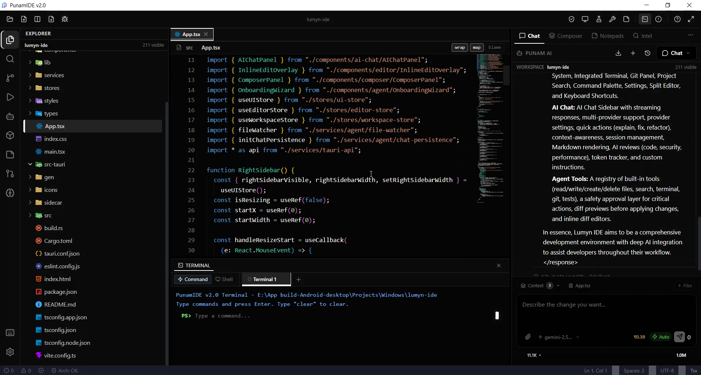

The AI panel is a full agentic loop — the model can autonomously use tools, read and write files, run commands, and iterate until the task is complete.

**Chat:**
- Multi-turn conversation with full project context awareness
- Attach files, images, and code snippets
- Export chat history
- Vision support (image input) for supported models
- Streaming responses with real-time token display

**Agent Tools — callable by AI:**

| Tool | Description |
|---|---|
| `read_file` | Read entire file content |
| `read_lines` | Read a specific line range |
| `write_file` | Create or overwrite a file |
| `apply_patch` | Apply a unified diff patch |
| `search_in_project` | Full-text search across all project files |
| `run_command` | Execute shell commands |
| `list_directory` | List folder contents |
| `search_symbol` | LSP-powered cross-file symbol lookup |
| `get_diagnostics` | Fetch current editor errors and warnings |

**Multi-Agent Orchestration:**


Spawn multiple specialized agents running in parallel:

| Agent Type | Permissions |
|---|---|
| `implementation` | Write to `src/`, `src-tauri/src/` |
| `test` | Write only to `*.test.ts` / `*.spec.ts` |
| `architecture` | Read-only observer — can veto patches |
| `security` | Read-only scanner — can block critical patches |
| `refactor` | Same as implementation + architecture re-validation |

**Safety & Control:**
- **Autopilot mode** — auto-approves safe reads/writes; dangerous commands still require approval
- **Supervised mode** — every write and command requires explicit per-action approval
- **Agent Approval Gate** — accept/reject individual tool calls
- **Budget enforcement** — set per-task token and cost limits with warning dialogs
- **Loop Guard** — prevents infinite tool-calling loops
- **Ambiguity detection** — AI asks clarifying questions before proceeding on unclear tasks
- **Architecture guardrail** — all AI-proposed writes validated against your defined rules before apply

**Context Intelligence:**
- **Context assembler** — pulls open files, symbols, git diff, errors into AI context
- **Context compressor** — smart truncation keeping the most relevant content
- **Context sidebar** — visual breakdown of what's in the AI context window
- **Context window bar** — live token usage indicator in chat

**Planning & Reasoning:**
- **Task Planner** — AI generates a step-by-step plan before executing
- **Reasoning Panel** — shows chain-of-thought in compact or expanded mode
- **Refinement loop** — post-response quality check and auto-retry
- **Session memory** — persists decisions and summaries across turns

---

### Code Editor

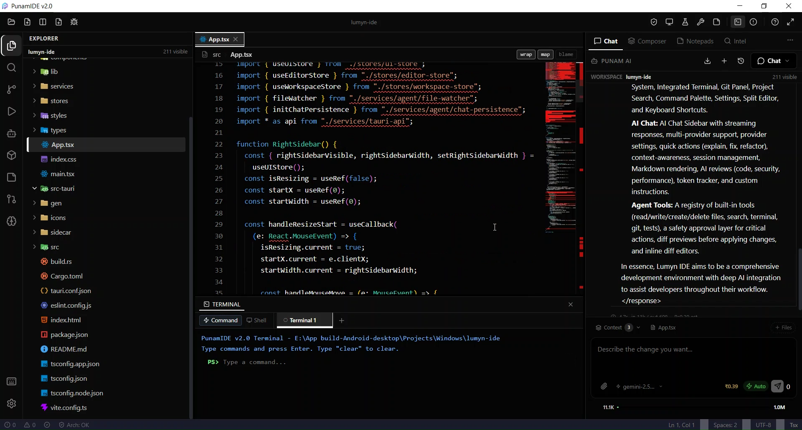

- **Monaco Editor** — identical to VS Code's editing engine
- **Split editor** — side-by-side file comparison
- **Inline AI Edit** (`Ctrl+K`) — edit selected code with a natural language instruction
- **Inline Diff Preview** — proposed changes shown in editor gutter before applying
- **Edit Preview Panel** — accept/reject AI edits per hunk
- **Breakpoint glyphs** — visual breakpoint markers
- **Find & Replace** — in-file search with regex
- **File templates** — new file creation with language-specific boilerplate
- **Auto-save** with configurable delay
- **Multi-tab editor** with tab management
- **Breadcrumbs** navigation bar
- **Fuzzy file picker** (`Ctrl+P`)

---

### Autocomplete

Ghost-text inline completion powered by AI with zero external services required.

- **FIM (Fill-in-Middle)** mode for models that support it (Codestral, DeepSeek Coder, etc.)
- **Chat fallback** mode for all other models
- **Auto-detect** — picks the best strategy per provider automatically
- **Completion cache** — avoids redundant API requests
- **Smart suppression** — no completions inside comments or string literals when not useful
- **Configurable:** debounce delay (150ms+), max tokens (16–512), enable/disable per project

---

### Terminal


- **Real PTY terminal** via `portable-pty` (Rust) — not a fake shell simulation
- **xterm.js** rendering with full ANSI color, fit, and web links
- **Multiple terminal sessions**
- **Terminal error parser** — auto-surfaces actionable quick-fix suggestions from errors
- **Proactive error detection** — watches output and notifies when build/test errors appear

---

### Git & GitHub


**Local Git** (native via `git2` Rust library — no `git` CLI required):
- Stage / unstage / commit
- Branch management
- Syntax-highlighted diff viewer
- Multi-file diff board
- Merge conflict panel with per-block accept/reject

**GitHub Integration:**


| Feature | Description |
|---|---|
| Authentication | OAuth flow |
| Repositories | Create, clone, push, pull |
| Issues | Create, list, comment, close |
| Pull Requests | Create, review, merge |
| Actions / CI | Monitor workflows, view logs |
| Gists | Create and manage |
| Sync | Push/pull with conflict detection |

---

### Debugger

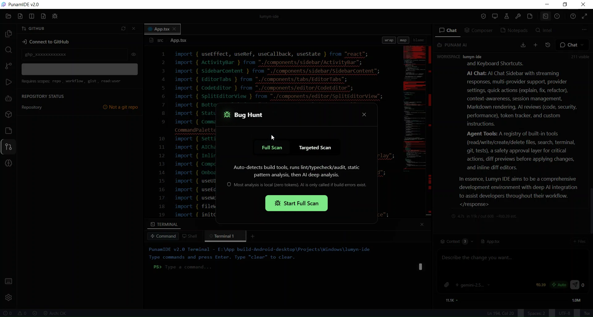


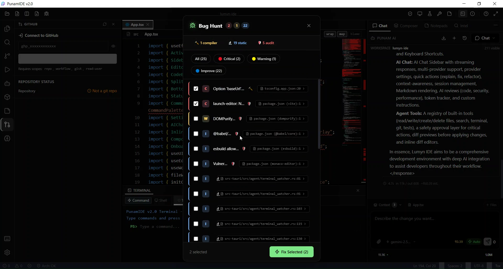

- **DAP (Debug Adapter Protocol)** — industry-standard debug protocol via Rust backend
- **DAPBridge** — frontend ↔ Rust communication layer
- **Debug configuration picker** — select and manage launch configs
- **Breakpoint management** — set, remove, toggle breakpoints
- **Variables, call stack, watch** panels
- **Run profiles** — configurable launch configurations

---

### Technical Debt Analyzer


AST-powered analysis that runs entirely in a **Web Worker** — no blocking the UI.

| Analyzer | Description |
|---|---|
| **AST Engine** | Tree-sitter parsing for JS, TS, Python, Rust |
| **Debt Scorer** | Quantified debt score per file and project |
| **Dependency Graph** | Full import/dependency graph builder |
| **Dead Code Analyzer** | Detects unreachable code |
| **Circular Dependency Detector** | Finds import cycles |
| **Coupling Analyzer** | Measures inter-module coupling |
| **Incremental Engine** | Updates graph on file change without full re-scan |
| **Diff Engine** | Tracks debt changes between commits |
| **Graph Exporter** | Export as JSON or SVG |
| **Refactor Planner** | AI-assisted refactor suggestion generation |

---

### Architecture Analysis


- **Dependency Graph View** — interactive visual graph (`@xyflow/react`)
- **Architecture Engine** — validates AI patches against your defined rules before apply
- **Rule Engine** — define custom architectural constraints
- **Impact Analyzer** — predicts blast radius of a proposed change
- **Change Predictor** — identifies what else might break
- **Violation Reporter** — surfaces rule violations with file and line context

---

### Security Scanner

- **Rust-native scanner** — fast, no external tools needed
- **Vulnerability patterns** — configurable rule set
- **Threat analyzer** — contextual severity assessment
- **Security Panel** — findings with severity levels and file context
- **Integration** with agent pipeline — security agent can block patches with critical findings

---

### Embeddings & RAG

- **100% local embeddings** via `@xenova/transformers` — runs in-browser, no API key needed
- **Embedding generator worker** — off-thread generation, no UI blocking
- **Vector store** — in-memory semantic search over your codebase
- **Embedding pipeline** (Rust) — batch processing for large projects
- **RAG Workbench** — test and tune retrieval quality
- **Chunk Inspector** — inspect how code is split and embedded
- **Hallucination Detector** — cross-checks AI responses against actual codebase content
- **Retriever Debugger** — debug why certain chunks are or aren't returned
- **Memory Engine** (Rust) — persistent embedding store with fast retrieval

---

### CI/CD Integration

- **CI Monitor** — watches GitHub Actions workflow runs in real time
- **Log Analyzer** — parses CI logs and extracts errors with context
- **Patch Generator** — generates fix suggestions from CI failure logs
- **Verification Runner** — runs local test/build checks before pushing
- **CI Dashboard** — visual pipeline status panel

---

### Docker

- **Docker Controller** (Rust) — manages container lifecycle natively
- **Docker Panel** — list, start, stop, inspect containers from inside the IDE

---

### MCP Support

[Model Context Protocol](https://modelcontextprotocol.io) — connect PunamIDE to external tools and data sources.

- **MCP Manager** — connect and manage MCP servers
- **MCP Settings** — configure server connections from the UI
- **Curated server list** — pre-configured popular MCP servers ready to enable
- **Tool routing** — MCP tool calls flow through the agent loop seamlessly

---

## Project Structure

```
PunamIDE v2.1.2/
|-- src/
|   |-- components/          # 70+ UI components
|   |   |-- chat/            # Message bubbles, tool cards, context bar
|   |   |-- github/          # GitHub panels
|   |   +-- settings/        # Settings UI
|   |-- services/            # Business logic (no direct UI)
|   |   |-- agent/           # Orchestration, budget, loop guard, approval
|   |   |-- architecture/    # Rule engine, impact analysis
|   |   |-- autocomplete/    # Ghost-text completion engine
|   |   |-- ci/              # CI/CD integration
|   |   |-- embeddings/      # RAG, vector store, hallucination detection
|   |   |-- intelligence/    # Context assembly, compression, injection
|   |   |-- lsp/             # LSP client and Monaco bridge
|   |   |-- mcp/             # MCP server management
|   |   |-- memory/          # Session memory, decision store
|   |   |-- refactor/        # Changeset-based refactoring
|   |   |-- security/        # Security scanning
|   |   |-- technicalDebt/   # AST engine, debt scoring, graph
|   |   +-- testgen/         # AI test generation
|   |-- store/               # Zustand state stores
|   |-- utils/
|   |   +-- toolLoops/       # Per-provider agent tool loops
|   |-- workers/             # Web Workers (AI, debt, embeddings)
|   +-- providers/anthropic/ # Anthropic streaming provider
|
|-- src-tauri/src/
|   |-- architecture/        # Rust dependency analysis
|   |-- github/              # GitHub API client (Rust)
|   |-- memory/              # Rust embedding store
|   |-- snapshot/            # Project snapshots
|   |-- agent_tools.rs       # Tauri commands for agent tools
|   |-- autocomplete.rs      # Autocomplete backend
|   |-- call_graph.rs        # Call graph analysis
|   |-- context_compressor.rs
|   |-- dap_manager.rs       # Debug Adapter Protocol
|   |-- docker_controller.rs
|   |-- embedding_pipeline.rs
|   |-- embeddings.rs
|   |-- environment_scanner.rs
|   |-- fs_commands.rs
|   |-- git_commands.rs      # Git operations (libgit2)
|   |-- index_commands.rs
|   |-- lsp_manager.rs
|   |-- package_manager.rs
|   |-- pty_manager.rs       # Real PTY terminal
|   |-- safety.rs            # Path validation
|   |-- search_commands.rs
|   |-- security_scanner.rs
|   |-- symbol_index.rs      # Tree-sitter symbol index
|   |-- terminal_commands.rs
|   +-- workspace_import.rs
|
|-- public/
|   |-- icons/               # 63 file-type SVG icons
|   +-- *.wasm               # Tree-sitter parsers (JS, TS, Python, Rust)
|
|-- media/
|   +-- screenshots/         # Screenshots and GIFs for this README
|
|-- README.md
|-- CHANGELOG.md
|-- CONTRIBUTING.md
|-- SECURITY.md
|-- LICENSE
+-- autorun.bat              # Windows one-click dev launcher
```

---

## Keyboard Shortcuts

| Shortcut | Action |
|---|---|
| `Ctrl+P` | Quick open file |
| `Ctrl+Shift+P` | Command palette |
| `Ctrl+Shift+F` | Project-wide search |
| `Ctrl+Shift+E` | Explorer |
| `Ctrl+Shift+G` | Source control |
| `Ctrl+Shift+H` | GitHub panel |
| `Ctrl+Shift+A` | Toggle AI panel |
| `Ctrl+K` | Inline AI edit |
| `Ctrl+B` | Toggle sidebar |
| `Ctrl+\`` | Toggle terminal |
| `Ctrl+S` | Save file |
| `Ctrl+Shift+S` | Save all |
| `Ctrl+W` | Close tab |
| `Ctrl+N` | New file |
| `Ctrl+F` | Find in file |

All shortcuts are fully customizable via **Settings → Keybindings**.

---

## Configuration

All settings persist via `tauri-plugin-store` in your OS app data directory. Configure via **Settings panel** (gear icon) — no config files to edit manually.

| Setting | Options |
|---|---|
| AI provider & model | Per-provider API key, model selection |
| Theme | Dark / Light / System |
| Font | Size, family |
| Editor | Tab size, word wrap, minimap, line numbers |
| Auto-save | Enable + delay |
| Autocomplete | Enable, mode (auto/fim/chat), debounce, max tokens |
| Agent mode | Autopilot / Supervised |
| Reasoning display | Compact / Expanded |
| Context injector | Strategy configuration |
| Context compressor | Compression strategy |
| Project rules | Custom instructions for every AI request |
| Ollama URL | Local Ollama endpoint |

---

## Testing

```bash
# Run all tests (single pass)
npm test

# Watch mode
npm run test:watch

# Lint
npm run lint
```

**Test coverage:**

| Suite | Description |
|---|---|
| Context limits & types | Validates context window size handling |
| Agent loop guard | Tests infinite loop prevention |
| Tool policies | Per-tool permission enforcement |
| Refactor service | Changeset creation and validation |
| Technical debt | AST engine, scorer, graph, coupling, circular deps |
| Streaming pipeline | Block parser, token buffer, scroll controller (property-based) |
| Security scanner | Integration tests for vulnerability detection |
| Multi-agent | Orchestration and conflict resolution |

Property-based tests use [fast-check](https://fast-check.dev/) for generative input testing.

---

## Build

```bash
# Build desktop installer (all targets)
cargo tauri build

# Frontend bundle only
npm run build
```

Output:
- Frontend → `dist/`
- Installer → `src-tauri/target/release/bundle/`

---

## Contributing

See [CONTRIBUTING.md](CONTRIBUTING.md) for setup instructions, coding standards, commit conventions, and the pull request process.

---

## Security

See [SECURITY.md](SECURITY.md) for the vulnerability reporting process and security model.

---

## Changelog

See [CHANGELOG.md](CHANGELOG.md) for the full version history.

---

## License

MIT © 2025 Amritanshu Amar — see [LICENSE](LICENSE) for details.

---

<div align="center">

**[Website](https://punamide.com) · [Download](https://github.com/punamide/punamide-downloads/releases) · [Discord](https://discord.gg/PFp9KWY3eY) · [X](https://x.com/PunamIDE)**

<br/>

Built with ❤️ using Tauri, React, and Rust.

</div>
